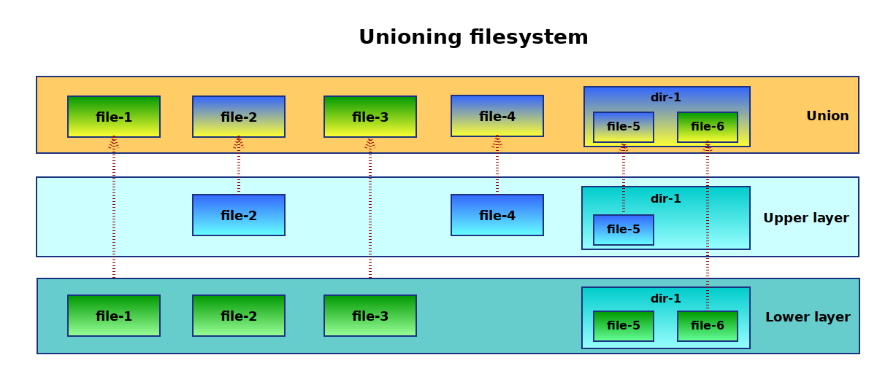

# Images and Containers

## What is an images?

Container images는 기본적으로 아카이브(tarball)이다. 해당 아카이브는 컨테이너 실행에 필요한 파일이나 디렉토리로 구성되어 있다. 

## How a container is created from an image?

이 부분은 개인적으로 늘 설명하기 어려웠다. Docker를 사용하지만 Docker Image의 근본이 어떻게 되는지 설명을 못했었다.

컨테이너 파일시스템은 적어도 두 계층을 가지고 있다. 
한 계층은 외부에서 변경할 수 없는 이미지라는 계층이고 또 다른 하나는 변경할 수 없는 이미지에 있는 파일을 쓰기 위해 파일을 쓰기 위한 임시 디렉토리를 가지고 있다.

이러한 구조는 [union mount](https://en.wikipedia.org/wiki/Union_mount) 라고 불린다. union mount는 두 개 혹은 그 이상의 디렉토리/파일시스템이 결합된 형태이다.



Lower layer와 Upper layer에 있는 Union layer에 파일과 디렉토리를 합쳐준다. 
예를 들어, file-1은 Lower layer에만 있기 그 파일 그대로 union layer에 때문이다. file-2은 Upper layer, Lower layer와 동시에 존재하기 때문에 Upper layer에 있는 file-2를 union layer에 있게 된다. 

## Unioning filesystems in Linux

리눅스에서 주로 쓰는 union 파일시스템은 다음과 같다.

* [UnionFS](http://unionfs.filesystems.org/)
* [aufs](http://aufs.sourceforge.net/)
* [overlayFS](https://www.kernel.org/doc/Documentation/filesystems/overlayfs.txt)

하지만 주로 overlayfs를 주로 쓴다. 그 이유는 kernel version 3.18부터 내장 되어 있기 때문에 별도의 설정 없이 바로 사용할 수 있다.

```
vagrant@linuxcontainer:/tmp$ cat /proc/filesystems
nodev	sysfs
nodev	rootfs
nodev	ramfs
nodev	bdev
nodev	proc
nodev	cpuset
nodev	cgroup
nodev	cgroup2
nodev	tmpfs
nodev	devtmpfs
nodev	configfs
nodev	debugfs
nodev	tracefs
nodev	securityfs
nodev	sockfs
nodev	dax
nodev	bpf
nodev	pipefs
nodev	hugetlbfs
nodev	devpts
	ext3
	ext2
	ext4
	squashfs
	vfat
nodev	ecryptfs
	fuseblk
nodev	fuse
nodev	fusectl
nodev	pstore
nodev	mqueue
	btrfs
nodev	autofs
	iso9660
nodev	vboxsf
nodev	aufs
nodev	overlay
```
만약 overlay 가 보이지 않는다면 ```modprobe overlay```를 수행하고 다시 /proc/filesystems를 읽어본다.

## Using overlay filesystem
[Reference] 

[Linux Filesystem Overlay - what is workdir used for? (OverlayFS)](https://unix.stackexchange.com/questions/324515/linux-filesystem-overlay-what-is-workdir-used-for-overlayfs)

[Union mount와 'whiteout'의 정의](https://en.wikipedia.org/wiki/Union_mount#cite_note-usenix-1)

[overlay](https://windsock.io/the-overlay-filesystem/)

[docker and overlayfs](https://docs.docker.com/storage/storagedriver/overlayfs-driver/#image-and-container-layers-on-disk-1)

overlay filesystem를 어떻게 동작되는 지, 직접 테스트 해보자. /tmp 디렉토리에 lower, upper, merged를 만들어 보자. 

```
root@linuxcontainer:~$ cd /tmp
root@linuxcontainer:/tmp# mkdir /tmp/lower /tmp/upper /tmp/workdir /tmp/merged
root@linuxcontainer:/tmp# sudo mount -t overlay -o   lowerdir=/tmp/lower,upperdir=/tmp/upper,workdir
```

lower/hello 빈 파일을 하나 만들어 본다.
upper/hello 파일을 새로 "hello world"라는 내용을 써본다.
그러면 merged/hello 파일이 생성되고 파일 내용에는 "hello world"라고 읽을 수 있다.
위에 union mount 그림을 보면 이 현상을 이해하기 쉬울 것이다.


```
root@linuxcontainer:/tmp# ls lower/ upper/ merged/
lower/:

merged/:

upper/:
root@linuxcontainer:/tmp# touch lower/hello
root@linuxcontainer:/tmp# echo "hello world" > upper/hello
root@linuxcontainer:/tmp# ls lower/ upper/ merged/
lower/:
hello

merged/:
hello

upper/:
hello
root@linuxcontainer:/tmp# cat merged/hello
hello world
root@linuxcontainer:/tmp# cat upper/hello
hello world
root@linuxcontainer:/tmp# cat lower/hello
root@linuxcontainer:/tmp# 
```


merged에 있는 hello를 지워 본다. 이때 upper 디렉토리에 hello 파일이 남는다. 이 남은 파일을 whiteout이라고 불린다.

```
root@linuxcontainer:/tmp# rm merged/hello
root@linuxcontainer:/tmp# 
root@linuxcontainer:/tmp# ls -l lower/ upper/ merged/
lower/:
total 0
-rw-r--r-- 1 root root 0 Nov 27 05:38 hello

merged/:
total 0

upper/:
total 0
c--------- 1 root root 0, 0 Nov 27 05:50 hello
```

컨테이너 파일시스템과 Overlayfs와 개념 상으로 매칭 시켜 보면 "컨테이너 이미지 계층"는 "lower 디렉토리", "컨테이너 계층"은 "upper 디렉토리", "실제로 유저가 바라보는 컨테이너 파일시스템"은 "merged"에 해당된다.


