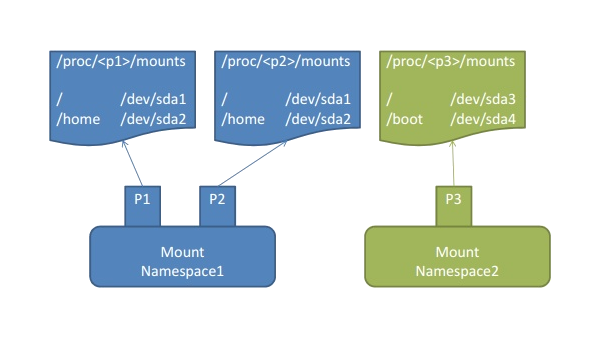
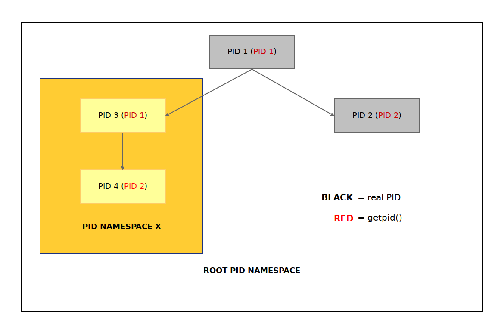

# Linux Namespaces

리눅스 네임스페이스는 


## Namespaces

|  namespace |  constant  |   Isolates      |
|------------|------------|-----------------|
|Cgroup|CLONE_NEWCGROUP|Cgroup root directory|
|IPC|CLONE_NEWIPC|System V IPC, POSIX messages queues|
|Network|CLONE_NEWNET|Network devices, stacks, ports, etc|
|Mount|CLONE_NEWNS|Mount points|
|PID|CLONE_NEWPID|Process IDs|
|User|CLONE_NEWUSER|User and group IDs|
|UTS|CLONE_NEWUTS|Hostname and NIS domain name|

```
root@linuxcontainer:/# echo $$
2030
```


```
root@linuxcontainer:/# ls -l /proc/$$/ns
total 0
lrwxrwxrwx 1 root root 0 Nov 29 02:37 cgroup -> 'cgroup:[4026531835]'
lrwxrwxrwx 1 root root 0 Nov 29 02:37 ipc -> 'ipc:[4026531839]'
lrwxrwxrwx 1 root root 0 Nov 29 02:37 mnt -> 'mnt:[4026531840]'
lrwxrwxrwx 1 root root 0 Nov 29 02:37 net -> 'net:[4026531993]'
lrwxrwxrwx 1 root root 0 Nov 29 02:37 pid -> 'pid:[4026531836]'
lrwxrwxrwx 1 root root 0 Nov 29 02:37 pid_for_children -> 'pid:[4026531836]'
lrwxrwxrwx 1 root root 0 Nov 29 02:37 user -> 'user:[4026531837]'
lrwxrwxrwx 1 root root 0 Nov 29 02:37 uts -> 'uts:[4026531838]'
```

```readlink``` 명령을 통해 해당 링크 파일이 바라보는 원본 파일 이름을 알 수 있다.
 
```
root@linuxcontainer:/# readlink /proc/$$/ns/uts
uts:[4026531838]
```
namespace type : [inode number]

/proc/[pid]/ns/cgroup
/proc/[pid]/ns/ipc
/proc/[pid]/ns/mnt
/proc/[pid]/ns/net
/proc/[pid]/ns/pid
/proc/[pid]/ns/pid_for_children
/proc/[pid]/ns/user
/proc/[pid]/ns/uts

## UTS namespaces
UTS namespaces provide isolation of two system identifiers: the host‐ name and the NIS domain name.


## Mount namespace
Mount namespaces provide isolation of the list of mount points seen
       by the processes in each namespace instance.
       
       
 A mount namespace has an owner user namespace.  A mount namespace
          whose owner user namespace is different from the owner user
          namespace of its parent mount namespace is considered a less
          privileged mount namespace.
          
```
root@linuxcontainer:/proc/2030/ns# cat /proc/$$/mounts
sysfs /sys sysfs rw,nosuid,nodev,noexec,relatime 0 0
proc /proc proc rw,nosuid,nodev,noexec,relatime 0 0
udev /dev devtmpfs rw,nosuid,relatime,size=1007932k,nr_inodes=251983,mode=755 0 0
devpts /dev/pts devpts rw,nosuid,noexec,relatime,gid=5,mode=620,ptmxmode=000 0 0
tmpfs /run tmpfs rw,nosuid,noexec,relatime,size=204116k,mode=755 0 0
/dev/sda1 / ext4 rw,relatime,data=ordered 0 0
securityfs /sys/kernel/security securityfs rw,nosuid,nodev,noexec,relatime 0 0
tmpfs /dev/shm tmpfs rw,nosuid,nodev 0 0
tmpfs /run/lock tmpfs rw,nosuid,nodev,noexec,relatime,size=5120k 0 0
tmpfs /sys/fs/cgroup tmpfs ro,nosuid,nodev,noexec,mode=755 0 0
cgroup /sys/fs/cgroup/unified cgroup2 rw,nosuid,nodev,noexec,relatime 0 0
cgroup /sys/fs/cgroup/systemd cgroup rw,nosuid,nodev,noexec,relatime,xattr,name=systemd 0 0
pstore /sys/fs/pstore pstore rw,nosuid,nodev,noexec,relatime 0 0
cgroup /sys/fs/cgroup/blkio cgroup rw,nosuid,nodev,noexec,relatime,blkio 0 0
cgroup /sys/fs/cgroup/cpuset cgroup rw,nosuid,nodev,noexec,relatime,cpuset 0 0
cgroup /sys/fs/cgroup/devices cgroup rw,nosuid,nodev,noexec,relatime,devices 0 0
cgroup /sys/fs/cgroup/pids cgroup rw,nosuid,nodev,noexec,relatime,pids 0 0
cgroup /sys/fs/cgroup/net_cls,net_prio cgroup rw,nosuid,nodev,noexec,relatime,net_cls,net_prio 0 0
cgroup /sys/fs/cgroup/perf_event cgroup rw,nosuid,nodev,noexec,relatime,perf_event 0 0
cgroup /sys/fs/cgroup/cpu,cpuacct cgroup rw,nosuid,nodev,noexec,relatime,cpu,cpuacct 0 0
cgroup /sys/fs/cgroup/rdma cgroup rw,nosuid,nodev,noexec,relatime,rdma 0 0
cgroup /sys/fs/cgroup/hugetlb cgroup rw,nosuid,nodev,noexec,relatime,hugetlb 0 0
cgroup /sys/fs/cgroup/memory cgroup rw,nosuid,nodev,noexec,relatime,memory 0 0
cgroup /sys/fs/cgroup/freezer cgroup rw,nosuid,nodev,noexec,relatime,freezer 0 0
systemd-1 /proc/sys/fs/binfmt_misc autofs rw,relatime,fd=27,pgrp=1,timeout=0,minproto=5,maxproto=5,direct,pipe_ino=12438 0 0
hugetlbfs /dev/hugepages hugetlbfs rw,relatime,pagesize=2M 0 0
mqueue /dev/mqueue mqueue rw,relatime 0 0
debugfs /sys/kernel/debug debugfs rw,relatime 0 0
fusectl /sys/fs/fuse/connections fusectl rw,relatime 0 0
configfs /sys/kernel/config configfs rw,relatime 0 0
lxcfs /var/lib/lxcfs fuse.lxcfs rw,nosuid,nodev,relatime,user_id=0,group_id=0,allow_other 0 0
vagrant /vagrant vboxsf rw,nodev,relatime 0 0
tmpfs /run/user/1000 tmpfs rw,nosuid,nodev,relatime,size=204112k,mode=700,uid=1000,gid=1000 0 0
overlay /var/lib/docker/overlay2/547b36fffe786f92252db58d6bb1d154ae4082d76fcabc1226a91ff56ccca594/merged overlay rw,relatime,lowerdir=/var/lib/docker/overlay2/l/XNNZPCZ5Y4H2PU2N2FXL2ZRTWX:/var/lib/docker/overlay2/l/X7RZOTU345T3CKUSGDR2UHBXY7:/var/lib/docker/overlay2/l/CHQSFQYHBGI4CGCROJSVW4KRAN,upperdir=/var/lib/docker/overlay2/547b36fffe786f92252db58d6bb1d154ae4082d76fcabc1226a91ff56ccca594/diff,workdir=/var/lib/docker/overlay2/547b36fffe786f92252db58d6bb1d154ae4082d76fcabc1226a91ff56ccca594/work 0 0
shm /var/lib/docker/containers/58e5ee012cb1764679a832deab08ab21343bef6352f4f04b8d4f053ec996e701/mounts/shm tmpfs rw,nosuid,nodev,noexec,relatime,size=65536k 0 0
nsfs /run/docker/netns/2b72f9aa9848 nsfs rw 0 0
```



## PID namespace

PID namespace는 PID 번호 체계를


## Network namespace

## Creating new namespaces

clone과 unshare system call을 할 수 있다.

namespaces api로는 clone , setns, unshare가 있다.