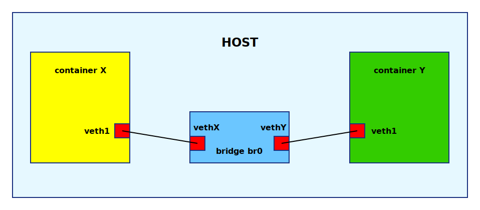

# Containers and networking

## Virtual Ethernet devices
[Reference]

[man 7 veth](http://man7.org/linux/man-pages/man4/veth.4.html)

veth는 "Virtual Ethernet devices"이다. veth는 다른 네임스페이스에 있는 물리적 네트워크 이더넷과 브릿지 간에 터널의 역할을 한다. 쉽게 생각해서, 두 이더넷 카드를 케이블로 연결한 형태라고 생각하면 된다.


## Connecting containers using bridge
[Reference]

[network namespace란?](https://lwn.net/Articles/580893/)

네트워크 네임스페이스 생성과 루트 네트워크 네임스페이스와 새로 생성한 네트워크 네임스페이스 간에 연결 테스트를 해보자.

네트워크 네임스페이스 생성하기 위해서는 ```clone()``` system call을 활용한 방법과 ip tool을 활용한 방법이 있다. 본 예제는 ip tool을 이용한다.

Container X에 veth1과 bridge br0에 vethX에 해당하는 예제이다.



현재 네트워크 인터페이스는 lo, enp0s3, enp0s8로 세개이다.

```
vagrant@linuxcontainer:~$ ip a
1: lo: <LOOPBACK,UP,LOWER_UP> mtu 65536 qdisc noqueue state UNKNOWN group default qlen 1000
    link/loopback 00:00:00:00:00:00 brd 00:00:00:00:00:00
    inet 127.0.0.1/8 scope host lo
       valid_lft forever preferred_lft forever
    inet6 ::1/128 scope host
       valid_lft forever preferred_lft forever
2: enp0s3: <BROADCAST,MULTICAST,UP,LOWER_UP> mtu 1500 qdisc fq_codel state UP group default qlen 1000
    link/ether 02:79:70:27:56:0f brd ff:ff:ff:ff:ff:ff
    inet 10.0.2.15/24 brd 10.0.2.255 scope global dynamic enp0s3
       valid_lft 86306sec preferred_lft 86306sec
    inet6 fe80::79:70ff:fe27:560f/64 scope link
       valid_lft forever preferred_lft forever
3: enp0s8: <BROADCAST,MULTICAST,UP,LOWER_UP> mtu 1500 qdisc fq_codel state UP group default qlen 1000
    link/ether 08:00:27:07:9d:19 brd ff:ff:ff:ff:ff:ff
    inet 192.168.99.50/24 brd 192.168.99.255 scope global enp0s8
       valid_lft forever preferred_lft forever
    inet6 fe80::a00:27ff:fe07:9d19/64 scope link
       valid_lft forever preferred_lft forever
```

네크워크 네임스페이스 생성을 위해 ip tool을 이용한다.
"netns1"라는 네트워크 네임스페이스 하나를 생성해보자.

```
vagrant@linuxcontainer:~$ ip netns add netns1
mkdir /var/run/netns failed: Permission denied
vagrant@linuxcontainer:~$ sudo -i
root@linuxcontainer:~# ip netns add netns1
root@linuxcontainer:~# ip netns list
netns1
root@linuxcontainer:~# ip netns exec netns1 ip link list
1: lo: <LOOPBACK> mtu 65536 qdisc noop state DOWN mode DEFAULT group default qlen 1000
    link/loopback 00:00:00:00:00:00 brd 00:00:00:00:00:00
```
lo 이더넷도 생긴 것을 확인했다.
루프백 테스트를 해보자. 
먼저, lo 인터페이스를 활성화하고 ping 테스트 해본다.

```
root@linuxcontainer:~# ip netns exec netns1 ping 127.0.0.1
connect: Network is unreachable
root@linuxcontainer:~# ip netns exec netns1 ip link set dev lo up
root@linuxcontainer:~# ip netns exec netns1 ping 127.0.0.1
PING 127.0.0.1 (127.0.0.1) 56(84) bytes of data.
64 bytes from 127.0.0.1: icmp_seq=1 ttl=64 time=0.024 ms
64 bytes from 127.0.0.1: icmp_seq=2 ttl=64 time=0.029 ms
^C
--- 127.0.0.1 ping statistics ---
2 packets transmitted, 2 received, 0% packet loss, time 1031ms
```

veth0와 veth용 인터페이스 veth1를 추가해보자.

```
root@linuxcontainer:~# ip link add veth0 type veth peer name veth1
root@linuxcontainer:~# ip a
1: lo: <LOOPBACK,UP,LOWER_UP> mtu 65536 qdisc noqueue state UNKNOWN group default qlen 1000
    link/loopback 00:00:00:00:00:00 brd 00:00:00:00:00:00
    inet 127.0.0.1/8 scope host lo
       valid_lft forever preferred_lft forever
    inet6 ::1/128 scope host
       valid_lft forever preferred_lft forever
2: enp0s3: <BROADCAST,MULTICAST,UP,LOWER_UP> mtu 1500 qdisc fq_codel state UP group default qlen 1000
    link/ether 02:79:70:27:56:0f brd ff:ff:ff:ff:ff:ff
    inet 10.0.2.15/24 brd 10.0.2.255 scope global dynamic enp0s3
       valid_lft 85994sec preferred_lft 85994sec
    inet6 fe80::79:70ff:fe27:560f/64 scope link
       valid_lft forever preferred_lft forever
3: enp0s8: <BROADCAST,MULTICAST,UP,LOWER_UP> mtu 1500 qdisc fq_codel state UP group default qlen 1000
    link/ether 08:00:27:07:9d:19 brd ff:ff:ff:ff:ff:ff
    inet 192.168.99.50/24 brd 192.168.99.255 scope global enp0s8
       valid_lft forever preferred_lft forever
    inet6 fe80::a00:27ff:fe07:9d19/64 scope link
       valid_lft forever preferred_lft forever
4: veth1@veth0: <BROADCAST,MULTICAST,M-DOWN> mtu 1500 qdisc noop state DOWN group default qlen 1000
    link/ether fa:b3:97:fb:00:6f brd ff:ff:ff:ff:ff:ff
5: veth0@veth1: <BROADCAST,MULTICAST,M-DOWN> mtu 1500 qdisc noop state DOWN group default qlen 1000
    link/ether 82:bc:87:b7:d7:12 brd ff:ff:ff:ff:ff:ff

```

 veth1를 netns1 네임스페이스에 추가해준다.

```
root@linuxcontainer:~# ip link set veth1 netns netns1
root@linuxcontainer:~# ip a
1: lo: <LOOPBACK,UP,LOWER_UP> mtu 65536 qdisc noqueue state UNKNOWN group default qlen 1000
    link/loopback 00:00:00:00:00:00 brd 00:00:00:00:00:00
    inet 127.0.0.1/8 scope host lo
       valid_lft forever preferred_lft forever
    inet6 ::1/128 scope host
       valid_lft forever preferred_lft forever
2: enp0s3: <BROADCAST,MULTICAST,UP,LOWER_UP> mtu 1500 qdisc fq_codel state UP group default qlen 1000
    link/ether 02:79:70:27:56:0f brd ff:ff:ff:ff:ff:ff
    inet 10.0.2.15/24 brd 10.0.2.255 scope global dynamic enp0s3
       valid_lft 85958sec preferred_lft 85958sec
    inet6 fe80::79:70ff:fe27:560f/64 scope link
       valid_lft forever preferred_lft forever
3: enp0s8: <BROADCAST,MULTICAST,UP,LOWER_UP> mtu 1500 qdisc fq_codel state UP group default qlen 1000
    link/ether 08:00:27:07:9d:19 brd ff:ff:ff:ff:ff:ff
    inet 192.168.99.50/24 brd 192.168.99.255 scope global enp0s8
       valid_lft forever preferred_lft forever
    inet6 fe80::a00:27ff:fe07:9d19/64 scope link
       valid_lft forever preferred_lft forever
5: veth0@if4: <BROADCAST,MULTICAST> mtu 1500 qdisc noop state DOWN group default qlen 1000
    link/ether 82:bc:87:b7:d7:12 brd ff:ff:ff:ff:ff:ff link-netnsid 0
    
```
추가 한 이후 인터페이스 4번이 사라지고 바로 5번이 나왔다. 명칭은 ```veth0@if4```이다. 이 의미는 veth0 인터페이스는 인터페이스(if) 4번과 연결되어있다는 의미다.

netns1 네임스페이스에 있는 veth1 인터페이스도 확인해보자.

netns1 네임스페이스에 veth1 인터페이스를 10.1.1.1/24를 할당한다.

```
root@linuxcontainer:~# ip netns exec netns1 ifconfig veth1 10.1.1.1/24 up
root@linuxcontainer:~# ip netns exec netns1 ip a
1: lo: <LOOPBACK,UP,LOWER_UP> mtu 65536 qdisc noqueue state UNKNOWN group default qlen 1000
    link/loopback 00:00:00:00:00:00 brd 00:00:00:00:00:00
    inet 127.0.0.1/8 scope host lo
       valid_lft forever preferred_lft forever
    inet6 ::1/128 scope host
       valid_lft forever preferred_lft forever
4: veth1@if5: <NO-CARRIER,BROADCAST,MULTICAST,UP> mtu 1500 qdisc noqueue state LOWERLAYERDOWN group default qlen 1000
    link/ether fa:b3:97:fb:00:6f brd ff:ff:ff:ff:ff:ff link-netnsid 0
    inet 10.1.1.1/24 brd 10.1.1.255 scope global veth1
       valid_lft forever preferred_lft forever
```
인터페이스 목록에서 4번이 바로 나오고 ```veth1@if5```라고 칭해졌다.
마찬가지로 veth1 인터페이스는 5번(veth0)과 연결되어 있다는 의미이다.
현재 ip가 ```10.1.1.1/24``` 을 veth1@if5에 할당을 했다.

```veth0```인터페이스에 ip를 ```10.1.1.2/24```을 할당 했다.

```
root@linuxcontainer:~# ifconfig veth0 10.1.1.2/24 up
root@linuxcontainer:~# ip a
1: lo: <LOOPBACK,UP,LOWER_UP> mtu 65536 qdisc noqueue state UNKNOWN group default qlen 1000
    link/loopback 00:00:00:00:00:00 brd 00:00:00:00:00:00
    inet 127.0.0.1/8 scope host lo
       valid_lft forever preferred_lft forever
    inet6 ::1/128 scope host
       valid_lft forever preferred_lft forever
2: enp0s3: <BROADCAST,MULTICAST,UP,LOWER_UP> mtu 1500 qdisc fq_codel state UP group default qlen 1000
    link/ether 02:79:70:27:56:0f brd ff:ff:ff:ff:ff:ff
    inet 10.0.2.15/24 brd 10.0.2.255 scope global dynamic enp0s3
       valid_lft 85792sec preferred_lft 85792sec
    inet6 fe80::79:70ff:fe27:560f/64 scope link
       valid_lft forever preferred_lft forever
3: enp0s8: <BROADCAST,MULTICAST,UP,LOWER_UP> mtu 1500 qdisc fq_codel state UP group default qlen 1000
    link/ether 08:00:27:07:9d:19 brd ff:ff:ff:ff:ff:ff
    inet 192.168.99.50/24 brd 192.168.99.255 scope global enp0s8
       valid_lft forever preferred_lft forever
    inet6 fe80::a00:27ff:fe07:9d19/64 scope link
       valid_lft forever preferred_lft forever
5: veth0@if4: <BROADCAST,MULTICAST,UP,LOWER_UP> mtu 1500 qdisc noqueue state UP group default qlen 1000
    link/ether 82:bc:87:b7:d7:12 brd ff:ff:ff:ff:ff:ff link-netnsid 0
    inet 10.1.1.2/24 brd 10.1.1.255 scope global veth0
       valid_lft forever preferred_lft forever
    inet6 fe80::80bc:87ff:feb7:d712/64 scope link tentative
       valid_lft forever preferred_lft forever
```

root 네트웨크 네임스페이스와 netns1 네트워크 네임스페이스 간에 ping test를 해보자.

```
root@linuxcontainer:~# ping 10.1.1.1
PING 10.1.1.1 (10.1.1.1) 56(84) bytes of data.
64 bytes from 10.1.1.1: icmp_seq=1 ttl=64 time=0.031 ms
^C
--- 10.1.1.1 ping statistics ---
1 packets transmitted, 1 received, 0% packet loss, time 0ms
rtt min/avg/max/mdev = 0.031/0.031/0.031/0.000 ms
root@linuxcontainer:~# ip netns exec netns1 ping 10.1.1.2
PING 10.1.1.2 (10.1.1.2) 56(84) bytes of data.
64 bytes from 10.1.1.2: icmp_seq=1 ttl=64 time=0.024 ms
^C
--- 10.1.1.2 ping statistics ---
1 packets transmitted, 1 received, 0% packet loss, time 0ms
rtt min/avg/max/mdev = 0.024/0.024/0.024/0.000 ms
```

netns1의 라우팅 테이블 확인해보자.

```
root@linuxcontainer:~# ip netns exec netns1 route
Kernel IP routing table
Destination     Gateway         Genmask         Flags Metric Ref    Use Iface
10.1.1.0        0.0.0.0         255.255.255.0   U     0      0        0 veth1
root@linuxcontainer:~# ip netns exec netns1 iptables -L
Chain INPUT (policy ACCEPT)
target     prot opt source               destination

Chain FORWARD (policy ACCEPT)
target     prot opt source               destination

Chain OUTPUT (policy ACCEPT)
target     prot opt source               destination
```


## iptables

```
sudo iptables -A FORWARD -i enp0s3 -o veth -j ACCEPT || true
sudo iptables -A FORWARD -o enp0s3 -i veth -j ACCEPT || true
sudo iptables -t nat -A POSTROUTING -s 172.16.0.0/16 -j MASQUERADE || true
sudo iptables -A FORWARD -i enp0s3 -o diyc0 -j ACCEPT || true
sudo iptables -A FORWARD -o enp0s3 -i diyc0 -j ACCEPT || true
sudo iptables -A FORWARD -o diyc0 -i diyc0 -j ACCEPT || true
```
