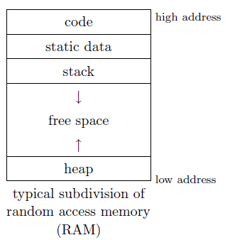
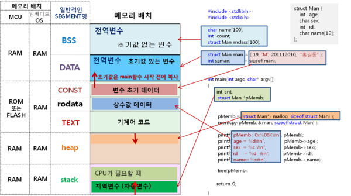

# Memory

[Reference]

[동적할당과 정적할당](http://ghgus0702.tistory.com/11?category=609086)

[wiki : 동적 메모리 할당](https://ko.wikipedia.org/wiki/동적_메모리_할당)

[wiki : new와 delete (C++) ](https://ko.wikipedia.org/wiki/New와_delete_(C%2B%2B))

## 프로그래밍 시 메모리는?

Stack 영역 - 지역변수, 사용자 정의함수, 잠깐 사용하고 삭제할 데이터 저장공간.

Heap 영역 - 동적할당, 사용자의 의사에 의해 원하는 데이터를 사용자정의에 의해 할당된 메모리에 저장하거나 해제.
              할당시 : malloc, new
              해제시 : free, delete
              
Data 영역 - 전역변수, 지역변수, static으로 선언되는 변수, 프로그래밍이 종료될 때 까지 지워지지 않을 데이터를 저장할 공간.

Code 영역 - Text, 코드를 저장할 공간. Editor에서 작성한 명령어들이 여기에 저장된다.

## Diagram Memery

## 메모리 관리 함수

|함수(function)	|기능  |
|------|-----|
|void * malloc ( size_t size );|size 바이트의 메모리를 힙에서 할당하여 반환한다.|
|void * calloc ( size_t num, size_t size );|(num * size) 바이트의 메모리를 힙에서 할당하고 포인터값을 반환한다.
|void * realloc ( void * ptr, size_t size );|ptr이 가리키는 메모리를 size 바이트만큼 힙에서 재할당하여 반환한다.|
|void free ( void * ptr );	ptr이 가리키는 메모리를 해제한다. |해제 전까지 계속 존재하므로 필요없으면 이 함수에 의해 해제해야 한다.|

|  연산자(operator)  |              기능              |
|------------------|-------------------------------|
|   new T          |   T 타입의 크기 만큼 메모리 할당     |
| delete  T.       |   T 타입의 크기 만큼 메모리 해제     |
	
		

###  new vs malloc ?

[Reference]

[stackoverflow : in-what-cases-do-i-use-malloc-vs-new
](https://stackoverflow.com/questions/184537/in-what-cases-do-i-use-malloc-vs-new)

new는 malloc는 다른 것이다. new 는 type에 맞춰서 생성자를 call 해주는 등 malloc을 쓰는 것보다 type safe한 방법입니다.

단, data buffer의 사이즈를 바꿀 때는 malloc을 쓰는게 더 낫습니다. new는 realloc같이 효율적으로 memory 크기를 늘였다 줄였다 해주는 기능은 없어서 크기를 바꾸려면 delete한 후 다시 할당해야 합니다.

|              |          new         |  malloc  |
|--------------|----------------------|----------|
|타입           |      operator.       | function|
|생성자 호출      |         O            |   X     |
|할당 성공 시, 반환|   해당 데이터 타입.      | (void *) |
|할당 실패 시, 반환|        NULL          |   NULL   |
|할당 후 재할당    | delete로 해제 후 재선언 | realloc 함수 이용 |
 

