# Process
[Ref] fork and exec <http://channelofchaos.tistory.com/55>

[Ref] System Call과 SubRoutine의 차이 <http://channelofchaos.tistory.com/37?category=382257>

[Ref] Differences between fork and exec <https://stackoverflow.com/questions/1653340/differences-between-fork-and-exec>

[Ref] System call <http://duksoo.tistory.com/entry/System-call-등록-순서>

[Ref] Subroutine <a name="subroutine_wiki"></a> <https://en.wikipedia.org/wiki/Subroutine>

[Ref] What is the difference between system call and library call? <https://stackoverflow.com/questions/29816791/what-is-the-difference-between-system-call-and-library-call>

## Subroutine vs System Call
쉽게 말하면 subroutine과 system call의 차이는 접근영역이 다르다.
subroutine이 system call을 호출하고 system call이 수행한 결과를 subroutine에 보내준다.
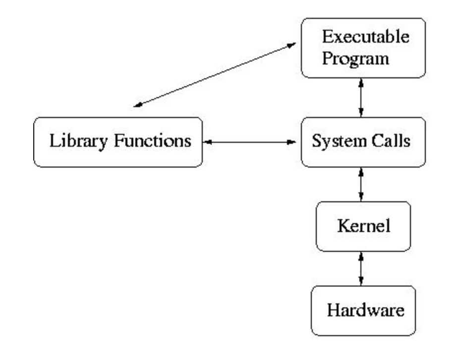

## Subroutine
 [Subroutine](#subroutine_wiki)은 각 언어별 function, procedure, routine, method, subprogram 이렇게도 불린다.

 함수 호출 방식 중 Call by Value, Call by Reference뿐만 아니라 wiki에 Call by result, Call by value-result, Call by name, Call by constant value 등의 기법이 있다.

## System Call
system call은 커널을 통해 h/w 자원을 제어한다. 이 문서는 process control 관점에서 설명할 것이다. 
### 1. File I/O
### 2. Process Control 
* fork()
* wait()
* exec : execcl(), execlp(), execv(), execvp()

### 3. InterProcess Communication

## fork vs exec

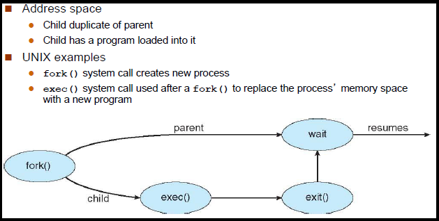


fork와 exec를 OS 관점에서 설명할 것이다.

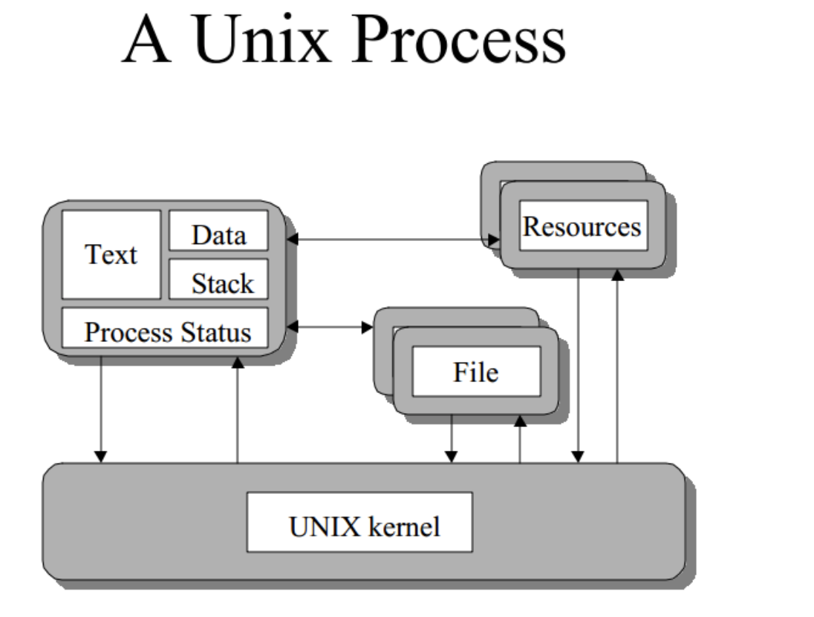


### fork
c언어로 다음과 같은 fork 예제를 실행해보자.

```c
#include <stdio.h>
#include <unistd.h>
#include <sys/wait.h>

int main(){
    printf("fork 전 현재 ppid = %d pid = %d \n", getppid() ,getpid());
    int status;
    pid_t cpid = fork();
    if(cpid == 0){
        
        printf("자식 프로세스 ppid = %d pid = %d cid = %d \n", getppid() , getpid(), cpid);
        
    }else{
        
        printf("현재 프로세스 ppid = %d pid = %d cid = %d \n", getppid() , getpid(), cpid);
        
        do {
            waitpid(cpid, &status, WUNTRACED);
        } while (!WIFEXITED(status) && !WIFSIGNALED(status));
    }
    return 0;
}


```

[실행 결과]
```
fork 전 현재 ppid = 6257 pid = 6256 
현재 프로세스 ppid = 6257 pid = 6256 cid = 6258 
자식 프로세스 ppid = 6256 pid = 6258 cid = 0 
Program ended with exit code: 0
```


#### 1. 프로그램 실행
 
 pid는 다음과 같다.
 
| pid|ppid| cpid|description|
|--- |---| --- | ---|
|25  | ?  | 0 |main process  |


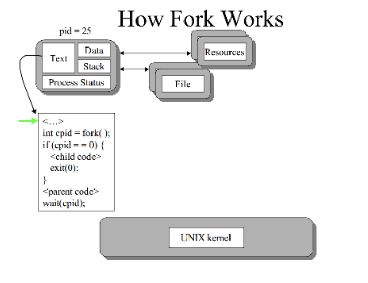

#### 2. fork 실행
fork로 process가 복제되고 child는 다른 pid가 할당된다.

| pid |ppid| cpid|         description           |
|---- |--- | --- | ------------------------      |
| 25  | ?  | 26  | main process (parent process) |
| 26  | 25 | 0   | forked process (child process)|


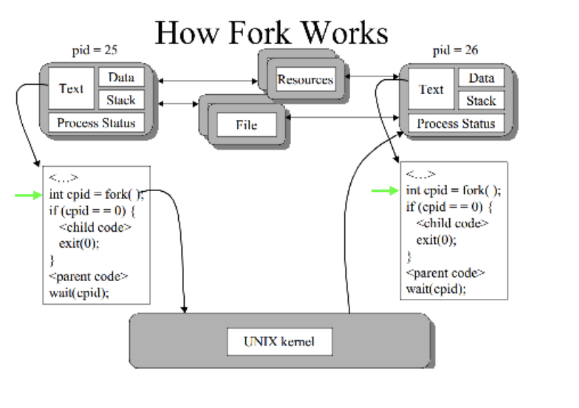

#### 3. fork pid 반환
fork의 반환 pid 값은 그 프로세스의 child pid이기 때문에 어느 프로세스이냐에 따라 다르다. 변수명을 cpid로 정의한 이유도 그것 때문
cpid == 0일때, child process 
cpid > 0일때, parent process 
cpid < 0일때, error  

| pid|ppid| cpid|description|
|--- |---| --- | ---|
|25  | 1  | 26 |main process  |
|26  | 25  | 0 |forked process  |

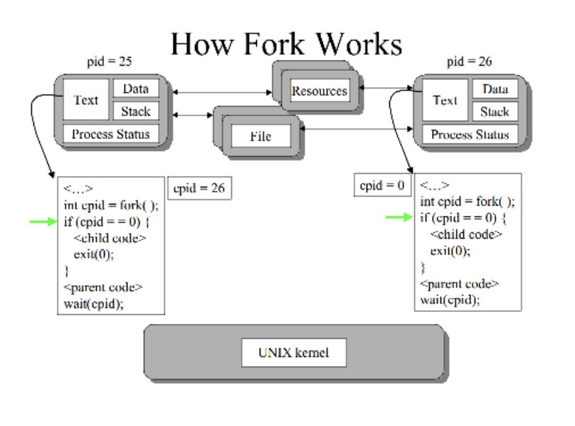

#### 4. parent process와 child process 간 실행영역 분기
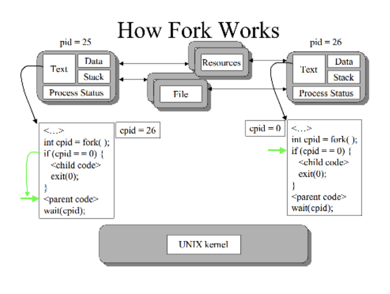

#### 5. wait
wait 함수로 child process가 종료되기를 대기하고 있다.
wait(cpid)로 pid 26번 프로세스가 종료될 때까지 대기하는 상태이다.
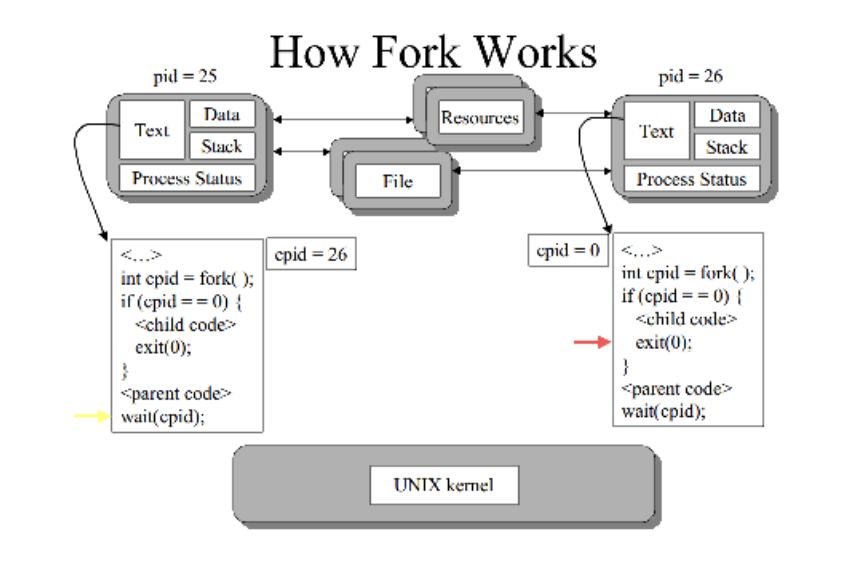

#### 6. child process 종료
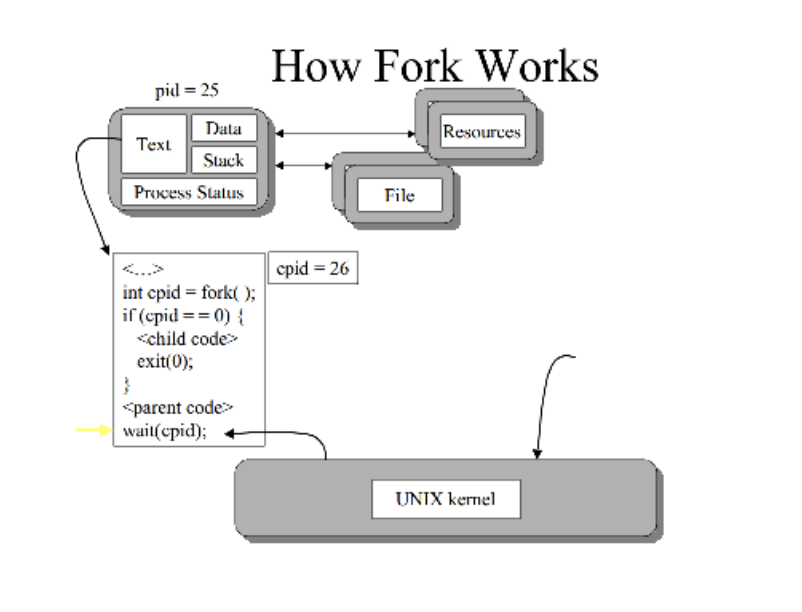


### exec
c언어로 다음과 같은 exec 예제를 실행해보자.

```c
#include <stdio.h>
#include <unistd.h>
#include <sys/wait.h>

int main(){
    printf("fork 전 현재 ppid = %d pid = %d \n", getppid() ,getpid());
    int status;
    pid_t cpid = fork();
    if(cpid == 0){
        
        printf("자식 프로세스 ppid = %d pid = %d cid = %d \n", getppid() , getpid(), cpid);
        char *argv[] ={ "ls", "-al", "/tmp", NULL};
        execvp("ls", argv);
        printf("exec 수행 후 [실행 X] 자식 프로세스 ppid = %d pid = %d cid = %d \n", getppid() , getpid(), cpid);
    
    }else{
        
        printf("현재 프로세스 ppid = %d pid = %d cid = %d \n", getppid() , getpid(), cpid);
        
        do {
            waitpid(cpid, &status, WUNTRACED);
        } while (!WIFEXITED(status) && !WIFSIGNALED(status));
    }
    return 0;
}

```
[실행 결과]
```
fork 전 현재 ppid = 6235 pid = 6234 
현재 프로세스 ppid = 6235 pid = 6234 cid = 6236 
자식 프로세스 ppid = 6234 pid = 6236 cid = 0 
lrwxr-xr-x@ 1 root  wheel  11 Nov  6 17:41 /tmp -> private/tmp
Program ended with exit code: 0
```

시나리오가 fork 1 ~ 4 설명과 동일하다.
fork 4번부터 실행한다.

#### 1. parent process와 child process 간 실행영역 분기

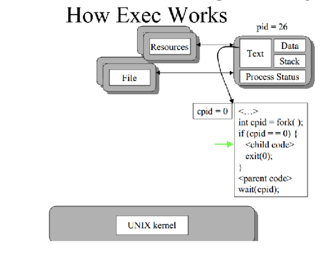

#### 2. exec 수행
exec는 사실 함수가 아니라 exec family 함수를 표현하는 문구이다.
exec
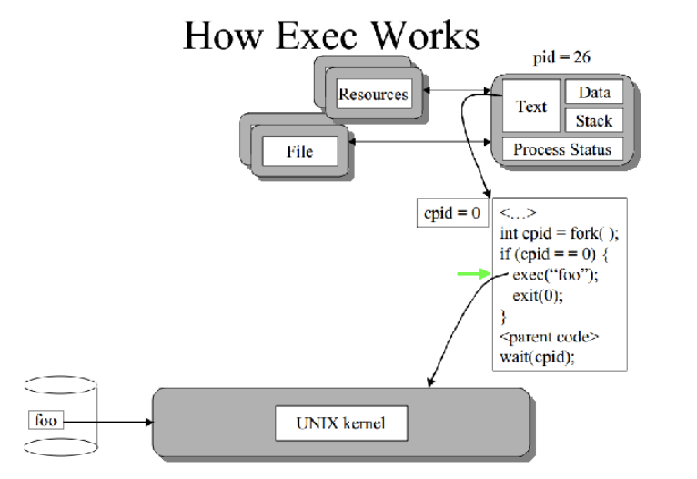

#### 3. exec 호출 후 kernel
exec 호출 후 kernel은 child process의 text, data, stack 등의 자원을 비우라를 요청을 하게 된다.
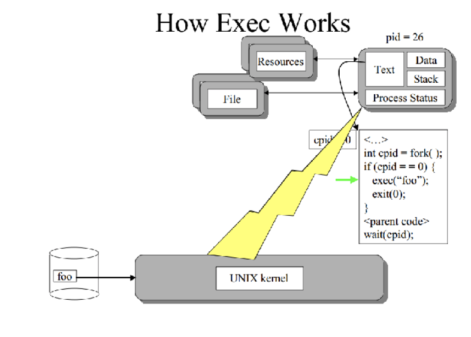

#### 4. child process 자원 해제
foo 자원 적재를 위해 child process의 자원을 전부 할당 해제한다.
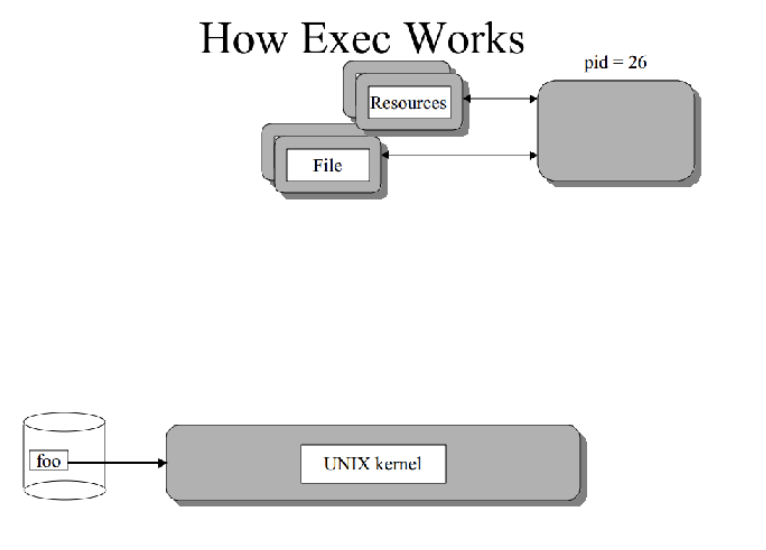

#### 5. foo 실행
pid 26에 foo 자원 적재 후, foo 명렁 수행한다.
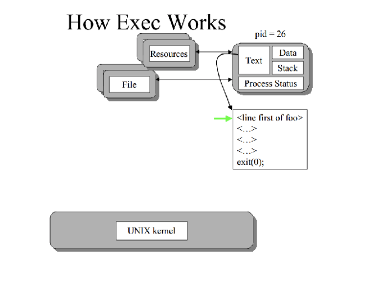


