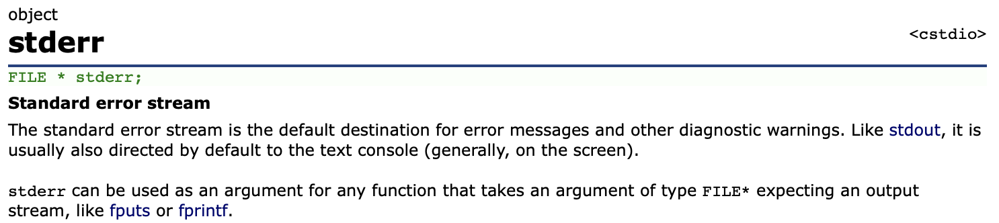

# Write a Shell in C


[Ref] Write a shell in c <https://brennan.io/2015/01/16/write-a-shell-in-c/>

[Ref] Cplusplus <a name="cpp"></a> <http://www.cplusplus.com>

[Ref] fork and exec <http://channelofchaos.tistory.com/55>

[Ref] System call <http://duksoo.tistory.com/entry/System-call-등록-순서>

[Ref] Subroutine <https://en.wikipedia.org/wiki/Subroutine>

[Ref] What is the difference between system call and library call? <https://stackoverflow.com/questions/29816791/what-is-the-difference-between-system-call-and-library-call>
<!--
[Link text](#some-id)-->
## Basic lifetime of a shell

top down 방식으로 shell 소스를 분석해본다.
쉘(shell)은 크게 세 가지의 프로세스로 동작한다.

* Initialize : 쉘은 설정 파일을 읽고(read), 실행한다.(execute)
* Interpret : stdin으로부터 명령어(interactive or file)를 읽고 실행한다.
* Terminate : 명령어를 수행 후, 쉘은 종료 명령을 실행하고 메모리를 비운 다음 종료한다.

쉘은 대부분의 프로그램에 적용되어있지만 
비교적 간단한 쉘이다. bash 쉘처럼 설정파일이 있는 것이 아닌 단순히 loop 상에 함수를 수행 후, 종료시킬 것이다.

단순히 looping 프로그램이 아닌 아키텍처 관점에서, 쉘의 lifecycle을 이해하는 것이 중요하다.

```c
int main(int argc, char **argv)
{
  // Load config files, if any.

  // Run command loop.
  lsh_loop();

  // Perform any shutdown/cleanup.

  return EXIT_SUCCESS;
}
```

## Basic loop of a shell

* Read : stdout으로 부터 명령을 읽음
* Parse : 명령어를 프로그램과 인자로 나눈다.
* Execute : Parse 처리된 명령을 실행한다.

```c
void lsh_loop(void)
{
  char *line;
  char **args;
  int status;

  do {
    printf("> "); // 프롬프트 출력
    line = lsh_read_line(); // Read
    args = lsh_split_line(line); // Parse
    status = lsh_execute(args); // Execute

    free(line);
    free(args);
  } while (status);
}
```

## Reading a line

stdin으로부터 한 줄을 읽는게 간단한 것처럼 들리지만, C에서는 번거롭다. 쉘 입장에서 유저가 입력할 text의 양을 모르기 때문이다. buffer 사이즈를 단순히 임의의 값으로 할당하는 것이 아닌 동적으로 재할당을 해주어야 한다.

```c
#define LSH_RL_BUFSIZE 1024
char *lsh_read_line(void)
{
  int bufsize = LSH_RL_BUFSIZE;
  int position = 0;
  char *buffer = malloc(sizeof(char) * bufsize);
  int c;

  if (!buffer) {
    fprintf(stderr, "lsh: allocation error\n"); // ①
    exit(EXIT_FAILURE);
  }

  while (1) {
    // Read a character ②
    c = getchar(); 

    // If we hit EOF, replace it with a null character and return.
    if (c == EOF || c == '\n') {
      buffer[position] = '\0';
      return buffer;
    } else {
      buffer[position] = c;
    }
    position++;

	 // ③ other
    // If we have exceeded the buffer, reallocate.
    if (position >= bufsize) {
      bufsize += LSH_RL_BUFSIZE;
      buffer = realloc(buffer, bufsize);
      if (!buffer) {
        fprintf(stderr, "lsh: allocation error\n");
        exit(EXIT_FAILURE);
      }
    }
  }
}
```

### ① int fprintf ( FILE * stream, const char * format, ... )
```c
fprintf(stderr, "lsh: allocation error\n");
```
이 부분에서 fprintf는 파일을 출력하는 함수로 알고 있었는데 stderr가 파라미터로 들어 갔다. [cplusplus](#cpp)에 검색해보면 stderr, stdin, stdout는 파일 포인터 타입이며 fprintf와 같은 stream 함수에 사용할 수 있다고 명시되어 있다.


### ② buffer를 char가 아닌 int 값으로 저장하는 이유
loop 안에서 문자를 읽을 때, char 타입이 아닌 int 타입에 저장한다.
**EOF는 문자가 아닌 정수 값(-1)이다.**

### ③ other
getline 함수를 이용하면 간단히 메모리 동적할당과 EOF처리가 가능하다.
<pre>
char *lsh_read_line(void)
{
  char *line = NULL;
  ssize_t bufsize = 0; // have getline allocate a buffer for us
  getline(&line, &bufsize, stdin);
  return line;
}
</pre>


## Parsing the line
공백(space, whitespace)으로만 구분하는 간단한 parser 함수를 보자.

```c
#define LSH_TOK_BUFSIZE 64
#define LSH_TOK_DELIM " \t\r\n\a"
char **lsh_split_line(char \*line)
{
  int bufsize = LSH_TOK_BUFSIZE, position = 0;
  char **tokens = malloc(bufsize * sizeof(char*));
  char *token;
  
  if (!tokens) {
    fprintf(stderr, "lsh: allocation error\n");
    exit(EXIT_FAILURE);
  }
  
  token = strtok(line, LSH_TOK_DELIM); // ①
  while (token != NULL) {
    tokens[position] = token;
    position++;
    
    if (position >= bufsize) {
      bufsize += LSH_TOK_BUFSIZE;
      tokens = realloc(tokens, bufsize * sizeof(char*));
      if (!tokens) {
        fprintf(stderr, "lsh: allocation error\n");
        exit(EXIT_FAILURE);
      }
    }
    
    token = strtok(NULL, LSH_TOK_DELIM);
  }
  tokens[position] = NULL;
  return tokens;
}
```
### ① char * strtok ( char * str, const char * delimiters );

LSH_TOK_DELIM " \t\r\n\a"의 구분문자를 기준으로 문자열을 split한다.

## How shells start processes
```c
int lsh_launch(char **args)
{
  pid_t pid, wpid; // ①
  int status;

  pid = fork(); // ②
  if (pid == 0) {
    // Child process
    if (execvp(args[0], args) == -1) { // ③
      perror("lsh");
    }
    exit(EXIT_FAILURE);
  } else if (pid < 0) {
    // Error forking
    perror("lsh");
  } else {
    // Parent process
    do { // ④
      wpid = waitpid(pid, &status, WUNTRACED);
    } while (!WIFEXITED(status) && !WIFSIGNALED(status));
  }

  return 1;
}
```
Subroutine vs System call
### ① pid_t
### ② process control
### ③ execvp
### ④ waitpid

## Shell Builtins

```c
/*
  Function Declarations for builtin shell commands:
 */
int lsh_cd(char **args);
int lsh_help(char **args);
int lsh_exit(char **args);

/*
  List of builtin commands, followed by their corresponding functions.
 */
char *builtin_str[] = {
  "cd",
  "help",
  "exit"
};

int (*builtin_func[]) (char **) = {
  &lsh_cd,
  &lsh_help,
  &lsh_exit
};

int lsh_num_builtins() {
  return sizeof(builtin_str) / sizeof(char *);
}

/*
  Builtin function implementations.
*/
int lsh_cd(char **args)
{
  if (args[1] == NULL) {
    fprintf(stderr, "lsh: expected argument to \"cd\"\n");
  } else {
    if (chdir(args[1]) != 0) {
      perror("lsh");
    }
  }
  return 1;
}

int lsh_help(char **args)
{
  int i;
  printf("Stephen Brennan's LSH\n");
  printf("Type program names and arguments, and hit enter.\n");
  printf("The following are built in:\n");

  for (i = 0; i < lsh_num_builtins(); i++) {
    printf("  %s\n", builtin_str[i]);
  }

  printf("Use the man command for information on other programs.\n");
  return 1;
}

int lsh_exit(char **args)
{
  return 0;
}
```

## Putting together builtins and processes

```c
int lsh_execute(char **args)
{
  int i;

  if (args[0] == NULL) {
    // An empty command was entered.
    return 1;
  }

  for (i = 0; i < lsh_num_builtins(); i++) {
    if (strcmp(args[0], builtin_str[i]) == 0) {
      return (*builtin_func[i])(args);
    }
  }

  return lsh_launch(args);
}
```


## Putting it all together

* \#include \<sys/wait.h>
	* waitpid() and associated macros
* \#include \<unistd.h>
	* chdir()
	* fork()
	* exec()
	* pid_t
* \#include \<stdlib.h>
	* malloc()
	* realloc()
	* free()
	* exit()
	* execvp()
	* EXIT_SUCCESS, EXIT_FAILURE
* \#include \<stdio.h>
	* fprintf()
	* printf()
	* stderr
	* getchar()
	* perror()
* \#include \<string.h>
	* strcmp()
	* strtok()
